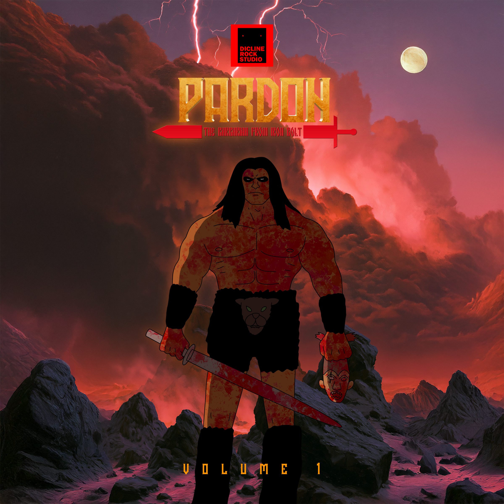

# Trashalaxy & Pardon — Public

  

  Official public releases for Pardon / Trashalaxy, created by <strong>Dicline Rock Studio</strong>. 
  Audiobooks, artwork, and selected materials.

## Pardon — Volume 1 · English Audiobook

The public English audiobook edition of *Pardon — Volume 1*: prologue, eight chapters, epilogue, and official 2026 cover artwork.

### Listen

1. [Prologue](audiobook/en/00_Prologue.wav)
2. [Chapter 1](audiobook/en/01_Chapter_1.wav)
3. [Chapter 2](audiobook/en/02_Chapter_2.wav)
4. [Chapter 3](audiobook/en/03_Chapter_3.wav)
5. [Chapter 4](audiobook/en/04_Chapter_4.wav)
6. [Chapter 5](audiobook/en/05_Chapter_5.wav)
7. [Chapter 6](audiobook/en/06_Chapter_6.wav)
8. [Chapter 7](audiobook/en/07_Chapter_7.wav)
9. [Chapter 8](audiobook/en/08_Chapter_8.wav)
10. [Epilogue](audiobook/en/09_EPILOGUE.wav)

### Artwork

- [Official 2026 cover and public PNG formats](cover/)
- [Illustrations by chapter and Concept Art](illustrations/)

Only materials cleared for public release are added here. Editable sources and unpublished work remain in the private archive.

## Rights

© 2016–2026 Oleg Karasev, Vladislav Karasev, Denis Karasev.
Created by Dicline Rock Studio. All rights reserved.

No permission is granted to copy, reproduce, adapt, distribute, or commercially use these materials without written authorization from the rights holders.
