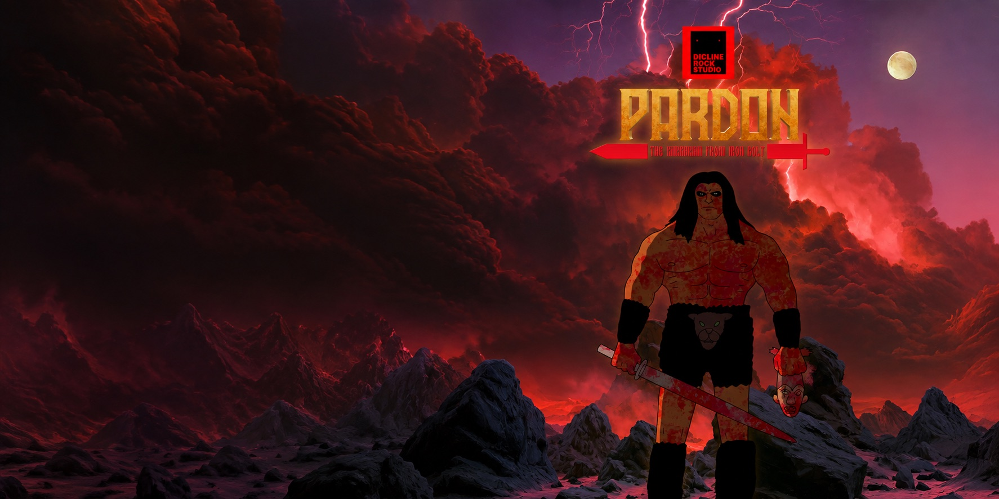

# Trashalaxy & Pardon

  

<strong>Created by Dicline Rock Studio</strong> Книги · Аудиокнига · Иллюстрации / Books · Audiobook · Artwork

## Начать здесь / Start here

| Что ищете / Explore | Открыть / Open |
| --- | --- |
| 📖 Первый том — готовая русская рукопись, V3.1 | [Читать на русском](books/volume-1/ru/Pardon-Volume-1-RU.md) |
| 📖 Volume 1 — completed English manuscript, v1.1 | [Read in English](books/volume-1/en/Pardon-Volume-1-EN.md) |
| 🎧 Первый том — английская аудиокнига | [Все аудиофайлы / Audio files](audiobook/en/) |
| 🎨 Арт — 79 уникальных изображений | [Открыть коллекцию / View collection](illustrations/concept-art/icloud-2026-10-02/) |
| 🖼 Обложки — PNG в разных размерах | [Обложки / Covers](cover/) |
| 📂 Иллюстрации по главам и Concept Art | [Раздел иллюстраций / Illustrations](illustrations/) |

Это публичная коллекция материалов вселенной **Trashalaxy & Pardon**. Первый том доступен на русском и английском; рабочие черновики следующих томов хранятся в приватном архиве.

This is the public collection for **Trashalaxy & Pardon**. Volume 1 is available in Russian and English; later-volume working drafts are kept in the private archive.

## Аудиокнига / English audiobook

Пролог, восемь глав и эпилог. Ссылки открывают отдельные WAV-файлы.

| Начало | Главы 1–4 | Главы 5–8 | Финал |
| --- | --- | --- | --- |
| [Prologue](audiobook/en/00_Prologue.wav) | [Chapter 1](audiobook/en/01_Chapter_1.wav) | [Chapter 5](audiobook/en/05_Chapter_5.wav) | [Epilogue](audiobook/en/09_EPILOGUE.wav) |
| | [Chapter 2](audiobook/en/02_Chapter_2.wav) | [Chapter 6](audiobook/en/06_Chapter_6.wav) | |
| | [Chapter 3](audiobook/en/03_Chapter_3.wav) | [Chapter 7](audiobook/en/07_Chapter_7.wav) | |
| | [Chapter 4](audiobook/en/04_Chapter_4.wav) | [Chapter 8](audiobook/en/08_Chapter_8.wav) | |

## Арт / Artwork

Коллекция из iCloud находится в [Concept Art](illustrations/concept-art/icloud-2026-10-02/). Названия исходных файлов сохранены; эти изображения пока не распределены по главам.

Папки для иллюстраций к истории: [пролог](illustrations/chapters/00-prologue/), [главы 1–8](illustrations/chapters/) и [эпилог](illustrations/chapters/09-epilogue/). Они подготовлены для дальнейшего наполнения.

## Авторы и права / Authors & rights

© 2016–2026 **Oleg Karasev, Vladislav Karasev, Denis Karasev**. Created by **Dicline Rock Studio**. All rights reserved.

No permission is granted to copy, reproduce, adapt, distribute, or commercially use these materials without written authorization from the rights holders.
